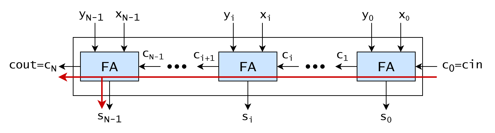

<!--
SPDX-FileCopyrightText: 2026 EPFL
SPDX-License-Identifier: CC-BY-SA-4.0
Author: David Mallasén
-->

# Carry-Ripple Adder

Combinational circuit that takes two N-bit numbers, `x` and `y`, and a
carry-in bit, `cin`, and outputs an N-bit sum, `s`, and a carry-out
bit, `cout`. Internally, it uses N full adders to perform the
addition. It is the baseline multi-bit adder, as it has minimal area but
maximal delay.

**Source**: [`hw/int/add/carry_ripple_adder/carry_ripple_adder.sv`](../../../../hw/int/add/carry_ripple_adder/carry_ripple_adder.sv)

**Verified by**: [`test/int/add/test_carry_ripple_adder.py`](../../../../test/int/add/test_carry_ripple_adder.py)

## Architecture

It contains N [`full_adder`](../full_adder/full_adder.md) instances in a
ripple chain: stage $i$'s carry-in is stage $i-1$'s carry-out, and stage
0 takes the module's input carry instead.

## Complexity

- **Area: $O(N)$**
    - N full adders, each a constant-size cell.
- **Delay: $O(N)$**
    - The carry traverses N stages, each contributing a constant AND-then-OR
        delay. The worst case is the input that forces the carry to
        travel the full width. In this case, the most significant sum
        bit is not stable until the carry has traversed all N stages.
    - The sum bits are *not* on the critical path: $s_i$ becomes valid
        one XOR delay after $c_i$ arrives.

## How it works

Each stage $i$ resolves the carry recurrence for one position. Because
stage $i$ needs $c_i$, which stage $i-1$ produces, the recurrence is
resolved **serially**: the carry ripples from the least significant
stage to the most significant one.
