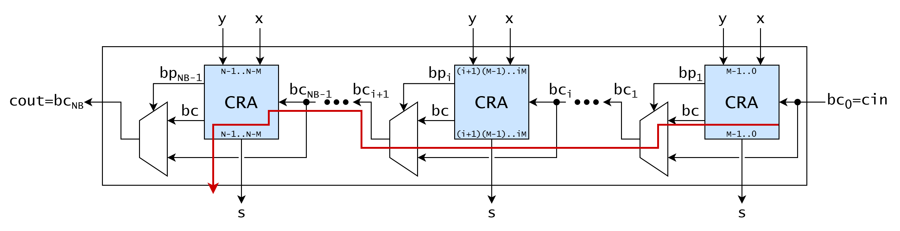

<!--
SPDX-FileCopyrightText: 2026 EPFL
SPDX-License-Identifier: CC-BY-SA-4.0
Author: David Mallasén
-->

# Carry-Skip Adder

A carry-skip adder is a type of adder that improves the delay of a
carry-ripple adder. Their interface is identical. The improvement is
based on the observation that if for a group of bits the propagate
signal is one for each of them, then the carry-out of the group is the
same as the carry-in of the group. This allows to "skip" the ripple
chain and reduce the delay.

**Source**: [`hw/int/add/carry_skip_adder/carry_skip_adder.sv`](../../../../hw/int/add/carry_skip_adder/carry_skip_adder.sv)

**Verified by**: [`test/int/add/test_carry_skip_adder.py`](../../../../test/int/add/test_carry_skip_adder.py)

## Architecture

The module composes $N/M$ [`carry_ripple_adder`](../carry_ripple_adder/carry_ripple_adder.md)
blocks of width $M$, each followed by a propagate-controlled carry
mux. The bit width of each block, $M$, is a parameter of the module. It
must divide $N$ evenly, and should be chosen to be close to $\sqrt{N}$ to
optimize the delay. The carry-out of a block is selected between the
carry-ripple adder's carry-out and the block's carry-in. The selection
is done by a multiplexer controlled by the block's propagate signal.

## Complexity

- **Area: $O(N)$**
    - $N/M$ ripple adders of $M$ bits each make up $N$ full adders, plus
        $N/M$ skip muxes and $N/M$ group-propagate AND trees ($O(M)$
        gates each, $O(N)$ in total).
- **Delay: $O(\sqrt{N})$**
    - Two block ripples of $M$ bits plus $\frac{N}{M}-1$ skip mux delays, minimized
        at $M \approx \sqrt{N}$.

## How it works

### Group propagate

The block propagate signal is the group-propagate property applied to a
block:

$$
bp_i = \bigwedge_{j \in \text{block } i} \big(x_j \oplus y_j\big)
     = \bigwedge_{j \in \text{block } i} p_j .
$$

The block propagates its incoming carry if and only if *every* bit
position in the block propagates. Because propagate is defined with
XOR, $bp_i = 1$ means the block's carry-out equals its carry-in.

### Skip network

The skip network of the adder reduces the length of the carry
propagation. This skip network provided for each group of $M$ bits makes
the carry bypass the block.

When $bp_i = 1$, the block's carry-ripple adder computes
$c_{out} = c_{in}$, the same value the skip mux selects. Bypassing
the block therefore does not change the result. It only removes the
block's internal ripple delay from the carry path.

When $bp_i = 0$, some position inside the block generates or kills the
carry. In this case, the block's own carry-out is used, and the mux adds
one multiplexer delay on top of the block's ripple delay.

### Delay analysis

The blocks of the adder produce several carry-propagation chains that
advance simultaneously. These chains are initiated in a block and can
terminate either in the same block or propagate through other blocks and
terminate in a further one.

Thus, the carry must ripple through at most two carry-ripple adder
blocks of $M$ bits and then traverse at most $\frac{N}{M}-1$ skip muxes:

$$
T \;\approx\; M+\frac{N}{M}.
$$

The first term increases and the second decreases with M, so the
optimum is where they balance. Treating the terms as continuous and
setting the derivative with respect to M to zero gives $M \approx \sqrt{N}$,
as $M$ also has to divide $N$ evenly, and a total delay of $O(\sqrt{N})$.

## Further notes

Two structural observations complete the picture:

- **The propagate trees are off the critical path.** Each
  $bp_i$ is a reduction-AND over $M$ bits computed in parallel from
  the operands, concurrently with the ripple chains. It does not
  lengthen the carry path; only the $N/M$ muxes do.
- **Fixed-size blocks are a simplification.** Variable block sizes
  (small blocks where carries are statistically likely to be
  generated, large blocks where they are not) can further reduce the
  average delay; this implementation uses equal blocks.
