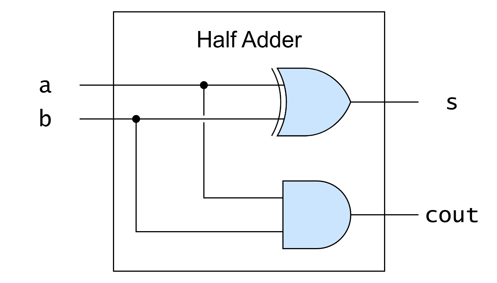

<!--
SPDX-FileCopyrightText: 2026 EPFL
SPDX-License-Identifier: CC-BY-SA-4.0
Author: David Mallasén
-->

# Half Adder

Combinational circuit that adds two 1-bit numbers. It is the smallest
binary adder and the starting point for the generate/propagate
decomposition of addition.

**Source**: [`hw/int/add/half_adder/half_adder.sv`](../../../../hw/int/add/half_adder/half_adder.sv)

**Verified by**: [`test/int/add/test_half_adder.py`](../../../../test/int/add/test_half_adder.py)

## Architecture

Two gates: an XOR producing the sum and an AND producing the carry-out.

## Complexity

- **Area: $O(1)$**
    - One XOR and one AND gate.
- **Delay: $O(1)$**
    - A single gate level.

## How it works

| `a` | `b` | `s` | `cout` |
| --- | --- | --- | --- |
| 0 | 0 | 0 | 0 |
| 0 | 1 | 1 | 0 |
| 1 | 0 | 1 | 0 |
| 1 | 1 | 0 | 1 |

The interesting observation is what the two outputs *are*: the sum of
two bits without a carry-in equals the propagate signal, and the
carry-out equals its generate signal.
